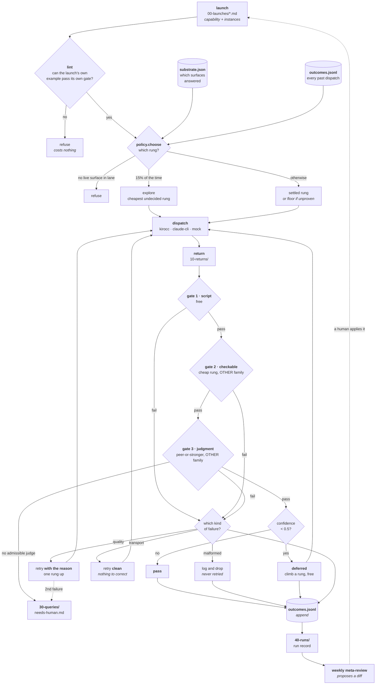

# Architecture

How the pieces connect, what each module owns, and where data goes.

Read [GETTING-STARTED.md](GETTING-STARTED.md) first if you haven't run anything
yet. Read [principles.md](principles.md) if you want to know *why* rather than
*what*.

---

## The shape of one run



Three things that flowchart is trying to make obvious:

1. **`outcomes.jsonl` is both an output and an input.** Today's verdicts are
   tomorrow's routing decision. That loop is the entire learning mechanism.
2. **The three failure classes go to three different places.** This is the
   distinction most worth internalising.
3. **The meta-review's arrow back to the launch is dotted.** It proposes; a
   human applies. Nothing automated edits the rules.

---

## Module map

Each module owns one decision. Dependencies point downward — nothing below
imports anything above it.

```
ladder ............. CLI. Argument parsing and printing. No logic.
  │
  ├── run.py ....... THE LOOP. Select → dispatch → gate → record → retry → stop.
  │     │            Owns: stop conditions, retry policy, run records.
  │     │
  │     ├── policy.py ...... WHICH RUNG. Reads gate verdicts, decides the tier.
  │     │                    Owns: promote/demote thresholds, exploration.
  │     │
  │     ├── dispatch.py .... SENDING WORK. Three adapters, one interface.
  │     │                    Owns: prompt assembly, transport errors, backoff.
  │     │
  │     ├── gate.py ........ ACCEPT OR REJECT. Four stages, cheapest first.
  │     │                    Owns: evidence rules, cross-family constraint,
  │     │                          failure classification, the human queue.
  │     │
  │     └── launch.py ...... WHAT TO RUN. Parses and validates a launch file.
  │
  ├── lint.py ........ Checks launches against the gate that will judge them.
  │
  ├── tiers.py ....... THE LADDER. Rungs, costs, climb order, family pairing.
  │                    Pure data + ordering. No I/O.
  │
  └── substrate.py ... WHAT IS REACHABLE. Probes surfaces, writes health.
                       No dependencies. The bottom of the stack.
```

### Why the split is where it is

- **`tiers.py` has no I/O** so the ladder's invariants (escalation is monotone,
  verifiers cross family) are testable as pure functions. Three tests do
  exactly that, across every rung.
- **`policy.py` never dispatches.** It takes a list of outcomes and returns a
  tier name. That's why the learning behaviour can be simulated over 14 runs in
  70 milliseconds.
- **`gate.py` never generates.** It only ever judges a `Return` it didn't
  produce. The module literally has no path to create work.
- **`substrate.py` imports nothing from the project.** It's the only module
  that knows a surface can be down, and everything above it treats availability
  as data.

---

## Who writes what

One author per directory. Numeric prefixes fix the write order, so returns can
never overwrite launches and the graph can never overwrite returns.

| Path | Written by | Tracked in git? |
|---|---|---|
| `SCHEMA.md`, `SKILL.md`, `CONSTRAINTS.md` | **you** (or the meta-loop's diff, applied by you) | yes |
| `00-launches/*.md` | **you** | yes |
| `runner/*.py`, `ladder`, `tests/` | **you** | yes |
| `10-returns/<run-id>/` | the runner | no |
| `20-graph/outcomes.jsonl` | the runner, **append-only** | **no** |
| `20-graph/substrate.json` | `ladder probe` | no |
| `40-runs/<run-id>.md` | the runner, **append-only** | no |
| `30-queries/needs-human.md` | the gate appends · **you** write decisions | no |

**Why the generated files are gitignored:** `outcomes.jsonl` isn't a log, it's
the routing policy's evidence. Shipping one person's outcomes would make a
fresh clone believe things measured on someone else's workload — including
transport failures from an outage, which say nothing about any model.

---

## The two lanes

The single most consequential structural fact.

```
                thin lane                        thick lane
              ─────────────                    ──────────────
 surface      kirocc (HTTP)                    claude -p (subprocess)
 overhead     ~91 input tokens                 ~22,800 input tokens
 tools        none                             Read, Glob, Grep, WebSearch…
 families     claude + gpt                     claude only
 good for     classify, extract, score,        edit files, read a repo,
              verify, summarise                multi-step work
 cheap rungs  pay off enormously               save 4.9× on a 100%-overhead floor
```

Two consequences that surprise people:

- **`gate: full` is impossible in the thick lane.** It has only one model
  family, so there's no cross-family verifier. `lint` catches this.
- **Down-routing is riskier in the thick lane** even at the same measured pass
  rate, because multi-step failures compound at every hop. Raise `floor_tier`
  there.

---

## The data model

One row in `outcomes.jsonl` per dispatch:

```json
{
  "capability": "triage-failures",
  "tier": "haiku-4.5",
  "verdict": "pass",
  "gate_stage": "pass",
  "reason": "",
  "instance": "HTTP 429: Too Many Requests",
  "run_id": "20260913T141256Z-triage-failures",
  "cost_usd": 0.0,
  "seconds": 0.81,
  "stamp": "2026-09-13T14:12:56+00:00"
}
```

Everything the system believes is derived from these rows by `policy.tally()`:

```
for each (capability, tier):
    trials    = rows where verdict not in (transport, deferred)
    passes    = rows where verdict == pass
    rate      = passes / trials
    decided   = trials >= 12
```

That's the whole model. No embeddings, no learned scorer, no per-query
difficulty estimate — deliberately, because the literature is clear that
reliable per-query difficulty prediction doesn't yet exist.

---

## Extending it

### Add a model
Add a `Tier(...)` to `LADDER` in `tiers.py`. Set `family` correctly — it's what
the cross-family constraint keys on. Run the tests; the invariant tests sweep
every rung, so a badly ranked addition fails immediately.

### Add a surface
1. Write a `probe_*()` in `substrate.py` that sends one real request.
2. Add it to `probe_all()`.
3. Write a dispatcher class in `dispatch.py` with a `run(works) -> [Return]`
   method, and register it in `DISPATCHERS`.
4. Add tiers pointing at it.

The `Return` contract is the only thing that matters: set `transport_error=True`
when the model **never answered**, and leave `record=None` when it answered
with something unparseable. Getting that distinction wrong is the one way to
corrupt the learning substrate.

### Add a gate stage
Gates are callables returning `(ok, reasons, retryable, verifier_tier)`. Insert
it into `run_gate()` **in cost order** — the whole ladder's economics depend on
the free checks running first.

### Add a capability
Write a launch in `00-launches/`. Run `./ladder lint <name>`. Then
`--dispatch mock`. Then a small real run with `--gate script`.

---

## Invariants (do not break without reading why)

These are each a defect that happened before it was a rule. Each has a test
named after it.

1. **Escalation is monotone in capability.** A failed rung never escalates to
   an equal rank, or the retry is a re-roll wearing a correction's clothes.
2. **A verifier never shares a model family with the generator.**
3. **Gate 3 refuses rather than using a weaker judge.** A weak judge passes
   exactly what the gate exists to catch, while reporting success.
4. **Transport failures stay out of the pass rate.** An outage must never push
   routing up the ladder.
5. **`needs-human.md` and `outcomes.jsonl` are append-only.**
6. **Anything that spends a dispatch appears in the run record** — including
   malformed replies, which are neither retried nor escalated.
7. **The meta-loop proposes diffs and never writes.**
8. **Nothing automated branches on high self-reported confidence.**
9. **Every writer resolves its path at call time**, never as a module-level
   default argument — that bug silently wrote test data into the real human
   queue.
